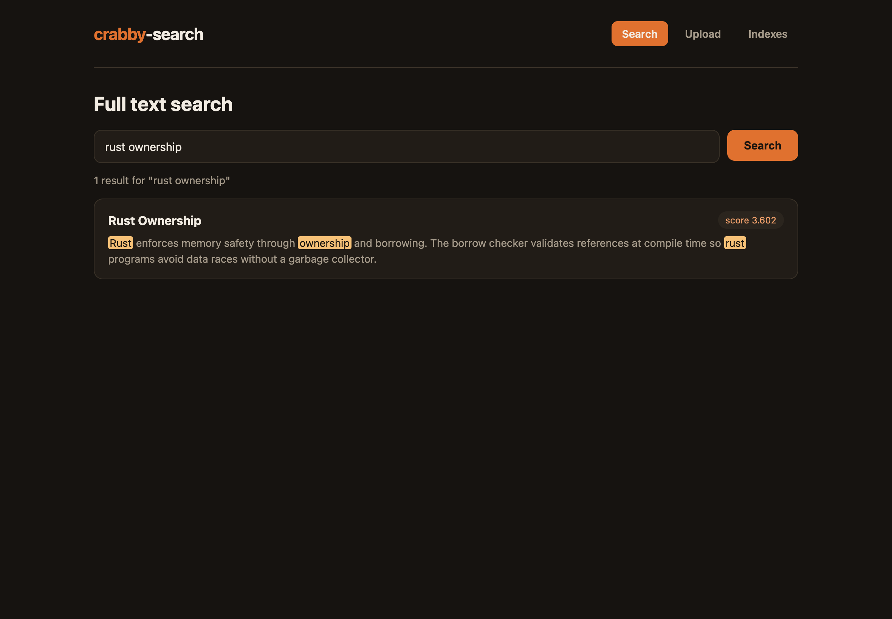
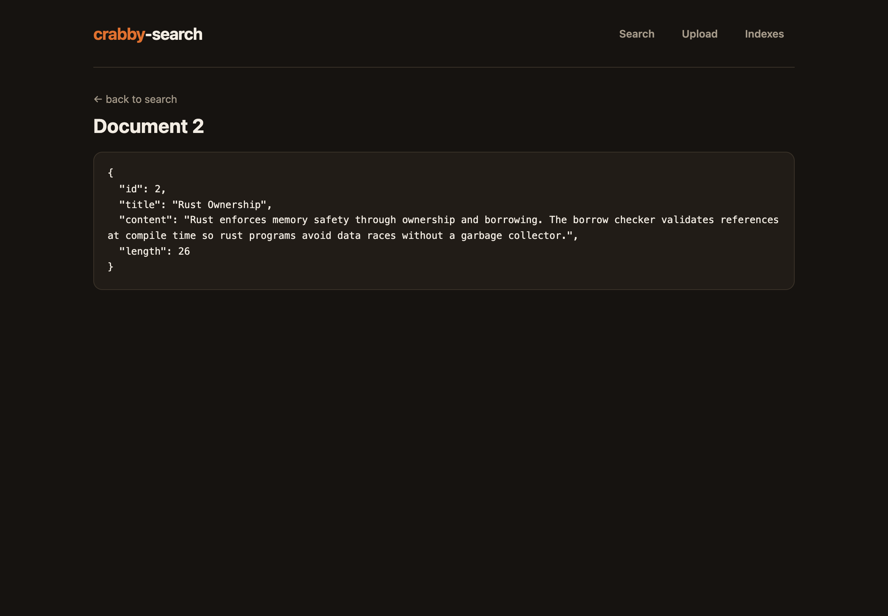
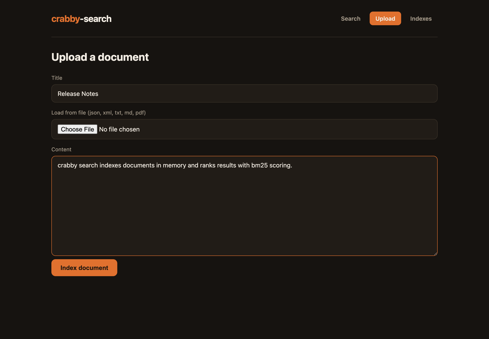
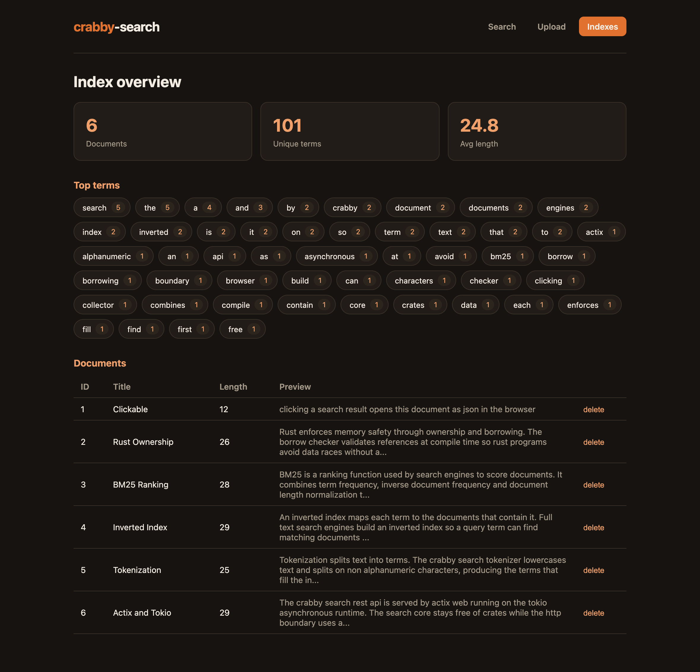

<p align="center">
  
</p>

# crabby-search

An in-memory full text search engine written in Rust, with a web admin built on
Vite, Bun, React and TanStack.

The search core (tokenizer, inverted index, BM25 ranking, document store) uses
only the Rust standard library. The REST API is served by actix-web on the Tokio
runtime. The web admin uploads documents, inspects the index, and runs ranked
searches.

## Documentation

- [design-doc.md](design-doc.md): architecture, modules, data model, and the API.
- [concepts.md](concepts.md): full text search, the inverted index, and BM25 explained.

## Features

- Index plain text documents in memory.
- Ranked search with BM25 scoring.
- Highlighted snippets around matching terms.
- Click any search result to view the full document as JSON.
- Index overview: document count, unique terms, average length, top terms.
- Upload by typing, pasting, or loading a json, xml, txt, md, or pdf file.
- Delete documents from the index.

## Stack

- Engine: Rust, edition 2024, toolchain 1.94 or newer.
- Search core: standard library only, no crates.
- REST layer: actix-web, actix-cors, serde, on the Tokio runtime.
- Web admin: Vite, Bun, React, TanStack Router, TanStack Query.
- File text extraction: built-in `File.text()` for json, xml, txt, md; `pdfjs-dist` for pdf.

## Layout

```
crabby-search/
  engine/                Rust search engine and REST API
    src/
      main.rs            Tokio runtime and actix-web server
      engine/            std-only search core
      api/               actix handlers, serde types, shared state
  web/                   Vite + Bun + React + TanStack admin
    src/
      api.ts             typed REST client
      router.tsx         TanStack Router route tree
      extract.ts         file to text dispatch (pdf lazy loaded)
      pdf.ts             pdf text extraction with pdfjs-dist
      routes/            Search, Document, Upload, Indexes pages
  docs/img/              web admin screenshots used by the README
  design-doc.md          design document
  concepts.md            search concepts and BM25 explained
  release.sh             build the engine release and the web bundle
  run-web.sh             start the engine and the web admin
  stop-web.sh            stop the engine and the web admin
```

## Requirements

- Rust 1.94 or newer with edition 2024 support.
- Bun 1.3 or newer.

## Quick start

```
./release.sh
./run-web.sh
```

Open `http://localhost:5173`. The web admin proxies `/api` to the engine on
`http://localhost:7700`, so the browser stays on one origin.

Stop everything:

```
./stop-web.sh
```

## Web admin

The admin has three pages plus a document view.

### Search

Type a query and rank documents with BM25. Each result shows its score and a
snippet with the matching terms highlighted.



### Document view

Click any search result to open the full document rendered as JSON, including its
content and indexed length.



### Upload

Add a document by typing or pasting content, or by loading a json, xml, txt, md,
or pdf file. Text formats are read directly in the browser; pdf text is extracted
client-side before indexing.



### Indexes

Inspect the index: document count, unique terms, average document length, the top
terms by document frequency, and every indexed document with a delete action.



## Scripts

- `release.sh`: builds the engine in release mode and builds the web bundle.
- `run-web.sh`: builds the engine if needed, starts it, waits for it to accept
  connections, then starts the Vite dev server. Process ids are written to
  `.engine.pid` and `.web.pid`; logs go to `engine.log` and `web.log`.
- `stop-web.sh`: terminates the recorded engine and web process trees.

## REST API

The engine listens on `127.0.0.1:7700`. Set `CRABBY_PORT` to change the port.

| Method | Path                   | Purpose |
|--------|------------------------|---------|
| GET    | `/api/health`          | liveness check |
| POST   | `/api/documents`       | index a document `{ "title", "content" }` |
| GET    | `/api/documents`       | list document summaries |
| GET    | `/api/documents/{id}`  | fetch one full document `{ id, title, content, length }` |
| DELETE | `/api/documents/{id}`  | remove a document |
| GET    | `/api/search?q=&limit=`| ranked search |
| GET    | `/api/index`           | index statistics |

Sample requests:

```
POST /api/documents
{ "title": "Rust", "content": "rust is a fast systems language" }

GET /api/search?q=rust+language
{
  "query": "rust language",
  "count": 1,
  "results": [
    { "id": 1, "title": "Rust", "score": 0.81, "snippet": "rust is a fast systems language" }
  ]
}
```

## Ranking

Documents are ranked with BM25 (`k1 = 1.2`, `b = 0.75`). Inverse document
frequency down-weights common terms, term frequency rewards repeated matches,
and document length normalization prevents long documents from dominating.

## Running the engine alone

```
cargo run --manifest-path engine/Cargo.toml
```

## Tests

```
cargo test --manifest-path engine/Cargo.toml
```

Tests cover tokenization, inverted index counts, index removal, and BM25
ranking order.

## Notes

- The index is in memory and is lost when the engine stops.
- There is no authentication; run it on a trusted local machine.
